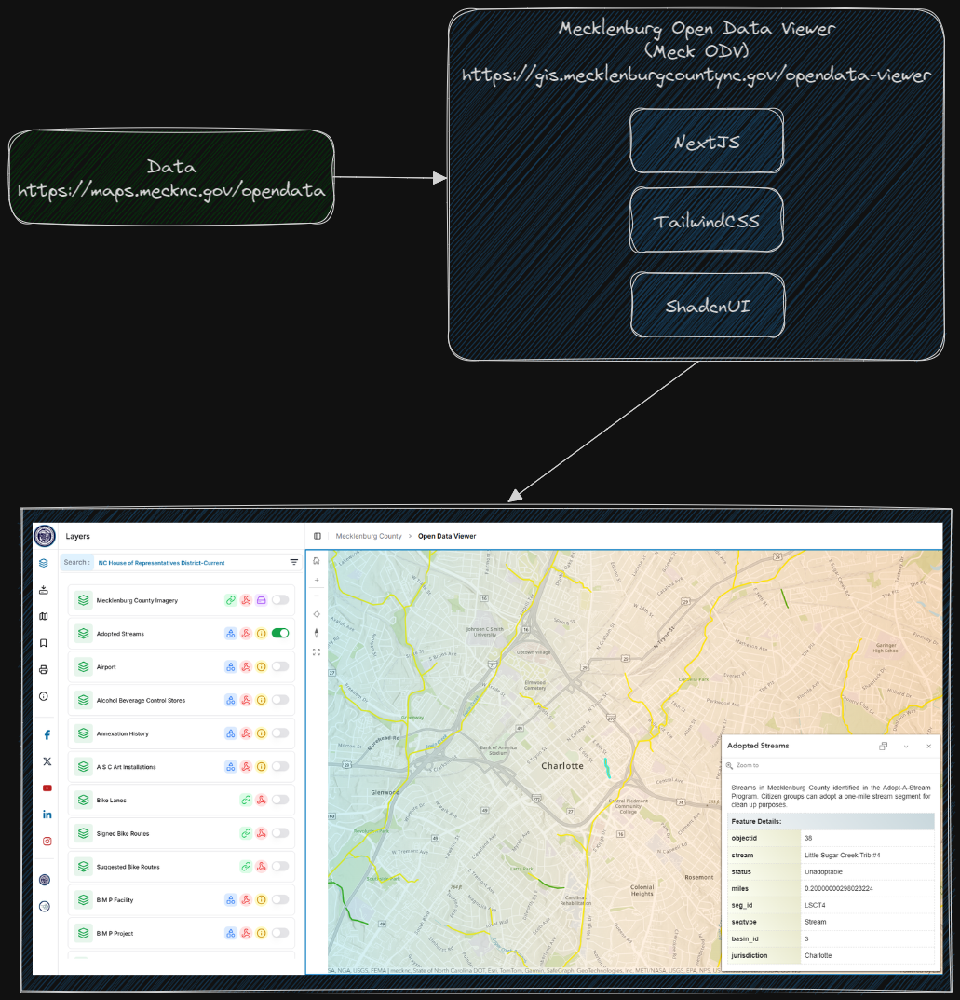

# Open Data Viewer

Mecklenburg County Open Data Viewer built with [Next.js](https://nextjs.org) project bootstrapped with [`create-next-app`](https://nextjs.org/docs/app/api-reference/cli/create-next-app).

Site: [https://gis.mecklenburgcountync.gov/opendata-viewer](https://gis.mecklenburgcountync.gov/opendata-viewer)


## Architecture




# Improvements & Fixes 
- Added Disclaimer modal popup
- Mobile friendly

### Clone the project

[Node.js](https://nodejs.org/en) is required to run the development and build systems, and [git](https://git-scm.com/) is required to use the versioning system.

```bash
git clone https://github.com/gencharitaci/opendata-viewer.git
```

### Install dependencies
```bash
cd opendata-viewer
npm install
```

### Start the development server

Run the development server:

```bash
npm run dev
# or
yarn dev
# or
pnpm dev
# or
bun dev
```

Open [http://localhost:3004/opendata-viewer](http://localhost:3004/opendata-viewer) with your browser to see the result.


This project uses [`next/font`](https://nextjs.org/docs/app/building-your-application/optimizing/fonts) to automatically optimize and load [Geist](https://vercel.com/font), a new font family for Vercel.

### Build for production
```bash
npm run build
```


## Learn More

To learn more about Next.js, take a look at the following resources:

- [Next.js Documentation](https://nextjs.org/docs) - learn about Next.js features and API.
- [Learn Next.js](https://nextjs.org/learn) - an interactive Next.js tutorial.

You can check out [the Next.js GitHub repository](https://github.com/vercel/next.js)
